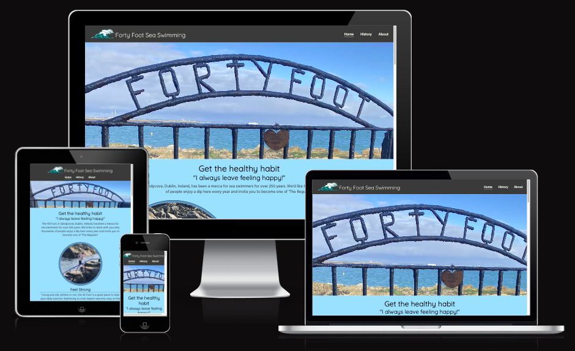

# Forty foot Sea Swimming

## Introduction
A website designed to attract visitors to the historic Forty foot swimming location in Sandycove, Dublin, Ireland.

Portfolio Project 1 - Stephen Docherty

[Project Repository](https://stevedoc-40foot-wq18d1gnah6.ws-eu90.gitpod.io)

[Live Site](https://steve-doc.github.io/40-foot/)

## Table of contents
1. [UX](#ux)

## <a name="ux">UX</a>

###  Strategy

    To attract visitors to The Forty Foot swimming facility.  Promoting the benefits of swimming in the sea and specifically this area. Highlighting other attractions and activities and also sharing the unique history of the Forty Foot.

#### User Stories

##### Users 
    I want to find out about the benefit of swimming in the sea.
    I want to find out about what makes the Forty Foot unique.
    I want to learn about the history of the Forty Foot.
    I want to find out about what else I can do or see while I am there.
    I want to stay in touch with any interesting events that might be upcoming or learn about other events that has taken place.
    I would like to check the weather and tide before I travel to the Forty Foot.
    I'd like to know how to get there.

##### Site owner
    I want to promote users partaking in a healthy activity.
    I want to promote visitors to the area but 
        * conveying healthy lifestyle choices.
        * uniques history of location
        * promoting popularity of location
    I want give visitors all the information they need to get to location and have a great experience
    I want to promote local businesses and attractions and attract advertising revenue.

### Scope

### Structure

### Skeleton

### Surface

## Features

### Existing Features
* #### Nav Bar
* #### Hero Image Section
* #### Swimming at the 40 Foot Section
* #### History of 40 Foot Section
* #### Footer
* #### Aprez Swim
* #### About Page

### Future Features

### Accessibility Features

## Testing

* ### Description of testing done
* ### Responsive design
* ### Bugs found a fixed
    1. On deployment discovered images failed to load.  
        Solved by changing image address to relative rather than absolute.
    2. Title under Apres Swim images was overlapping images.
        Solved by adding a container around images and adding padding bottom to image and container.
    3. Container border around circular image became eliptical at certain points when screen was narrowed for smaller devices.
        Solved by using media queries to give images and container defined, small width and height at smaller screen sizes.
    
* ### Code andCSS validators
* ### Testing User Stories from User Experience (UX) Section

* ### Bugs found a not fixed yet
    1. Tidal script on about page doesn't format correctly at small screen sides.  Don't know how to style a called JS yet.

## Deployment

* How site was deployed
* Link to live production site

## Credits

### Code

    Any code that came from another source
### Content

    History section based on 40ft wikipedia entry https://en.wikipedia.org/wi

### Media

    Credit and image/video sources
    40-foot-gentlemans-bathing.jpeg - The Irish Independant https://www.independent.ie/lifestyle/turning-the-tide-30113564.html 
    40-foot-women-rights.png - Meanwhile in Ireland website https://meanwhileinireland.com/on-this-day-irish-women-protested-men-only-bathing-at-the-forty-foot/
    40-foot-james-joyce.jpeg The Art of Dark Pod website https://artofdarkpod.com/the-underbred-james-joyce/
    sandycove-beack.png Dublin Guide https://www.dublinguide.ie/places/sandycove-beach
    killiney-hill.png Curious Ireland https://curiousireland.ie/killiney-obelisk/
    sup.jpg unsplash.com

### Acknowledgements
    
    Mentor
    Tech Support